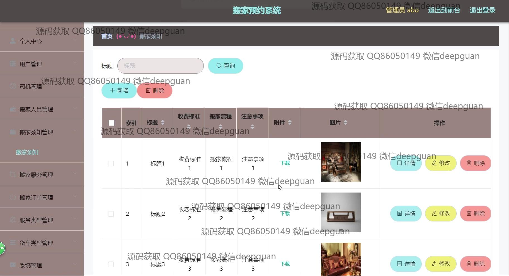
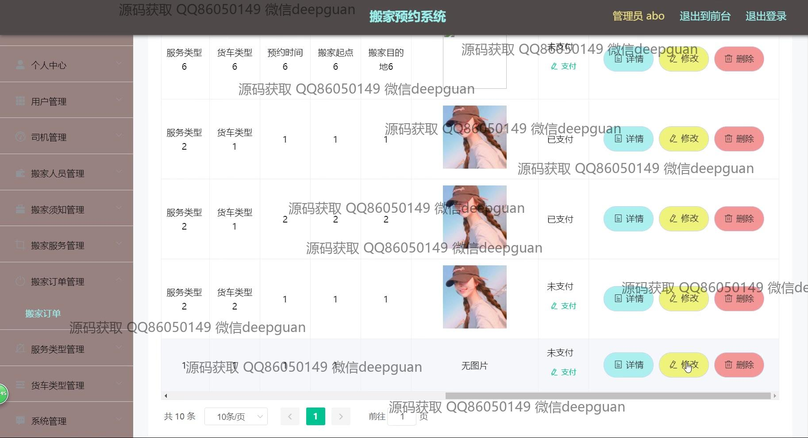
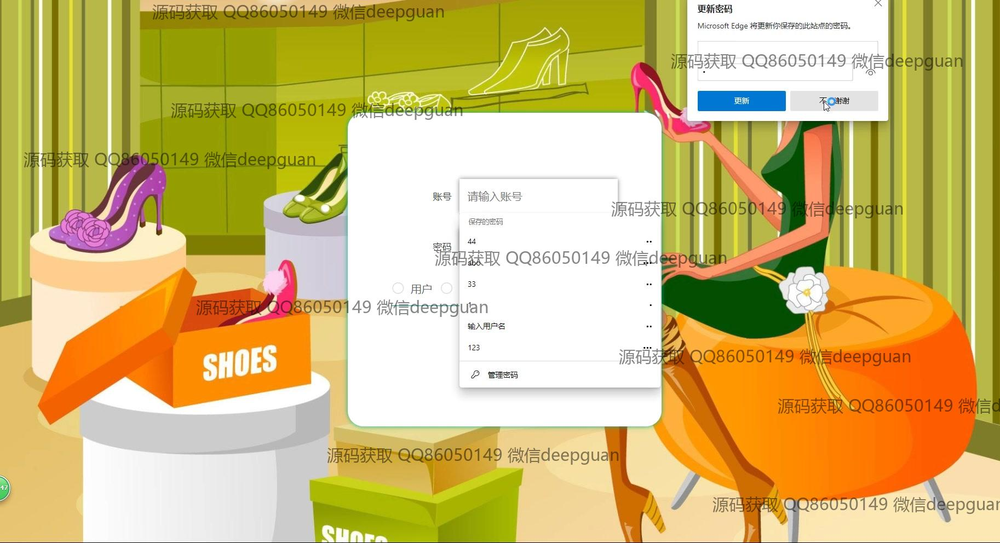

<h1 align="center">基于vue的搬家预约系统+vue</h1>

## 简介
基于Vue的搬家预约系统：角色分为管理员和用户；包含用户管理、司机管理、搬家人员管理、搬家须知、服务管理、订单管理、客服互动等功能模块。    --计算机毕业设计源码；毕设源码；java毕业设计源码

## 联系方式

<h3 align="center">获取完整代码与数据库文件 + 微信：deepguan QQ: 86050149 QQ群: 783742310</h3>

<h3 align="center">可帮忙远程部署 包运行成功！提供远程部署、修改代码、设计文档指导、代码讲解等服务！</h3>

## 功能介绍（完整见运行截图）
管理员：基本功能包括系统登录、注册以及注销。提供用户、司机、搬家人员管理，搬家须知、服务、订单及类型管理，货车类型维护和后台系统调整。用户信息和系统设置的增删改查，通过导航栏快捷访问各管理模块。用户信息界面支持信息编辑、密码修改及权限管理，同时具备上传功能，便于更新和管理用户数据。系统管理涉及支付方式配置，包括微信、支付宝及多家银行选项，提升支付的便利性和灵活性。

用户：系统功能涵盖注册登录和个人信息管理，提供用户个人信息及预约信息的在线编辑与维护。用户通过个人中心可查看预约服务，并在需要时修改或取消订单。选择预约日期、服务类型，填写和提交个人信息以完成预约流程。信息更新以及预约确认功能以简洁直观的方式展示，确保用户易于使用和体验良好。支持通过在线客服与系统互动，获取实时帮助，客服界面设计友好，便捷用户沟通。

## 运行截图

本代码来源于网络,仅供学习参考使用!

